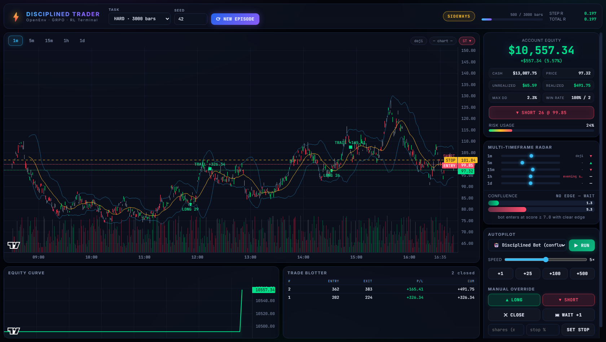
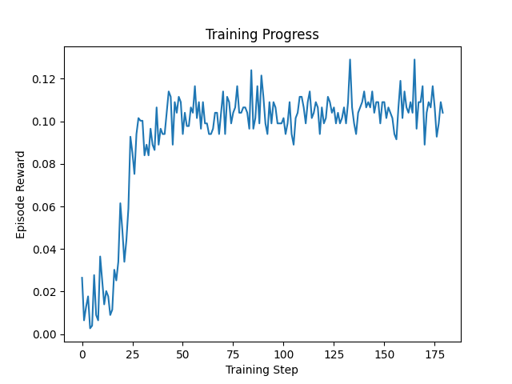

# 📈 DisciplinedTraderEnv: LLM Trading Agent via OpenEnv & GRPO

**OpenEnv Hackathon 2026 Submission**

> 🔗 **Important Links:**
> - 🚀 **[Hugging Face Space Demo](https://huggingface.co/spaces/NGGAMER/disciplined-trader-train)**
> - 📖 **[Mini-Blog / Video Pitch](https://github.com/namangolchha20/DisciplinedTraderEnv/blob/main/BLOG.md)**
> - 📓 **[Training Colab Notebook](https://colab.research.google.com/drive/1aSE4ajCWd29D0Bn9vFtJviAzuyhjGsuZ#scrollTo=O7jhNgUCsFjK)**

---

## Overview

Most LLM trading agents fail in live environments because they treat trading as next-token prediction — hallucinating invalid actions, revenge trading, and blowing up on drawdowns.

**DisciplinedTraderEnv** is a partially observable, multi-timeframe financial simulator built on [OpenEnv](https://github.com/openenv/openenv). We train a **Qwen2.5-0.5B-Instruct** agent with **GRPO** (via TRL + Unsloth) to output valid JSON trading actions while respecting risk rules.

The repo also ships a **live web trading terminal** — no frontend build step, served directly from FastAPI.



---

## Features

### Web terminal (`http://localhost:7860`)

| Feature | Details |
|---|---|
| Charts | Multi-TF candlesticks (1m / 5m / 15m / 1h / 1d), SMA-20, Bollinger Bands, volume, entry/stop lines, trade markers |
| Autopilot | Disciplined Bot, Trained LLM (GRPO), SMA crossover, Random — 1×–25× speed |
| Manual mode | Long / short / close / set stop — hotkeys: `Space`, `→`, `L`, `S`, `C` |
| Radar | RSI, SuperTrend, candle/chart patterns across all timeframes |
| Grading | S/A/B/C/D/F rank ring from official task graders at episode end |

### Trained LLM mode

- Loads a LoRA adapter from `./trained_trader_lora/` (hot-reloads after retraining)
- ~6 s per bar on a 4 GB GPU (RTX 3050 class) — speed slider is disabled in LLM mode
- **Automatic risk overlay**: when the LLM waits (`do_nothing`), the server applies the same trailing stops and confluence exits as the Disciplined Bot

---

## Quick start (Windows)

Requires **Python 3.12**, **NVIDIA GPU** (for training + LLM inference), and **Git**.

```powershell
git clone https://github.com/namangolchha20/DisciplinedTraderEnv.git
cd DisciplinedTraderEnv

# Create venv & install deps (CUDA 12.6 torch)
python -m venv .venv312
.\.venv312\Scripts\python.exe -m pip install -U pip
.\.venv312\Scripts\python.exe -m pip install torch --index-url https://download.pytorch.org/whl/cu126
.\.venv312\Scripts\python.exe -m pip install -r requirements.txt

# Start the web terminal
.\run_server.ps1
# → open http://127.0.0.1:7860
```

### Train & evaluate

```powershell
# GRPO training (saves adapter to ./trained_trader_lora/)
.\run_train.ps1

# Compare LLM vs baselines (needs trained adapter)
.\run_evaluate.ps1
```

> **Note:** `trained_trader_lora/` is gitignored. Train locally or upload weights separately for deployment.

---

## Quick start (Linux / macOS)

```bash
python3 -m venv .venv
source .venv/bin/activate
pip install -U pip
pip install torch --index-url https://download.pytorch.org/whl/cu126   # or cpu index if no GPU
pip install -r requirements.txt

export HF_HOME="$(pwd)/hf-cache"
uvicorn server.app:app --host 0.0.0.0 --port 7860
```

---

## Project structure

```
DisciplinedTraderEnv/
├── env/                  # OpenEnv environment, policies, graders, model loader
├── server/               # FastAPI backend + static web terminal
├── inference.py          # GRPO training (Unsloth + TRL)
├── evaluate.py           # Benchmark LLM vs rule-based baselines
├── run_server.ps1        # Start terminal (Windows)
├── run_train.ps1         # Start training (Windows)
├── run_evaluate.ps1      # Run evaluation (Windows)
├── trained_trader_lora/  # LoRA adapter (created by training, gitignored)
├── training_state.json   # Seed cursor for successive training runs
└── requirements.txt
```

---

## Tasks

| Task | Bars | Volatility | Grader focus |
|------|:----:|:----------:|--------------|
| easy | 500 | low | profit + trade discipline + drawdown |
| medium | 1500 | medium | profit + win rate + drawdown |
| hard | 3000 | high | profit + trade count + drawdown |

Changing **TASK** or **SEED** in the terminal auto-starts a new episode.

---

## The environment

**Observation:** Multi-TF OHLCV, cash, position, unrealized PnL, chart patterns, market regime.

**LLM actions (JSON):** `open_long`, `open_short`, `close_position`, `do_nothing`

**Reward shaping:** Format compliance, execution validity, pattern alignment, drawdown tracking, revenge-trading detection, hold-winner bonus.

### Calibrated graders

| Task | Profit | Win Rate | Discipline | Max Drawdown |
|------|:------:|:--------:|:----------:|:------------:|
| easy | 0.5 | — | 0.2 (1–8 trades) | 0.3 (10% budget) |
| medium | 0.4 | 0.3 | — | 0.3 (15% budget) |
| hard | 0.4 | — | 0.3 (1–30 trades) | 0.3 (20% budget) |

---

## Training pipeline

- **Base model:** `unsloth/Qwen2.5-0.5B-Instruct` (fits 4 GB GPUs; switch to 1.5B on T4+)
- **Method:** GRPO with environment reward + JSON format reward
- **Output:** `./trained_trader_lora/` (used by server + next training run)
- **Checkpoints:** `trading_agent/checkpoint-*` saved every 20 steps during training, deleted after a successful run (final adapter is kept)



Training is **resumable**: successive runs continue from the saved adapter and fresh market seeds (`training_state.json`).

### Before / after baseline comparison

Evaluated in `evaluate.py` over unseen test data:

| Agent | Mean Reward |
|---|---|
| Random | `-19.78 ± 0.69` |
| SMA Crossover | `-0.50 ± 0.00` |
| Trained GRPO LLM | *(run `evaluate.py` after training)* |

---

## API

| Endpoint | Purpose |
|---|---|
| `POST /reset`, `POST /step` | OpenEnv-compliant RL interface |
| `GET /api/status` | LLM adapter availability |
| `POST /api/reset` | Start demo episode `{task, seed}` |
| `POST /api/step` | Advance demo `{mode: manual\|bot\|sma\|random\|llm, steps, ...}` |
| `POST /agent/predict` | Query trained LLM directly |

---

## Hugging Face Spaces

**Space:** [NGGAMER/disciplined-trader-train](https://huggingface.co/spaces/NGGAMER/disciplined-trader-train)

Upload project files to the Space repo (Files tab or `git push` to the Space). Settings:

| Setting | Value |
|---|---|
| SDK | Docker |
| App port | `7860` |
| Hardware | **GPU** for Trained LLM; CPU basic for Bot/SMA/Random only |

### Upload the trained LoRA (for LLM mode)

1. Create a **Model** repo: `NGGAMER/disciplined-trader-lora`  
2. Upload everything inside `./trained_trader_lora/` (web UI **Upload files** or CLI):

```powershell
.\.venv312\Scripts\python.exe -m huggingface_hub.cli login
.\.venv312\Scripts\python.exe -m huggingface_hub.cli upload NGGAMER/disciplined-trader-lora ./trained_trader_lora
```

3. On first LLM step, the Space **auto-downloads** that repo into `./trained_trader_lora/` (override with env var `HF_ADAPTER_REPO`).

### Local Docker

```bash
docker build -t disciplined_trader .
docker run -p 7860:7860 -e HF_ADAPTER_REPO=NGGAMER/disciplined-trader-lora disciplined_trader
```

---

## Tips

- **Always use the project venv** — system Python won't have torch (`run_server.ps1` handles this).
- **Caches** — scripts store Hugging Face / pip caches in `./hf-cache` and `./pip-cache` inside the project folder.
- **Don't train + run LLM inference simultaneously** on a 4 GB GPU — run one at a time.
- **Fast demo?** Use Disciplined Bot. **Watch the trained agent?** Use Trained LLM (GRPO).

---

## License

MIT
